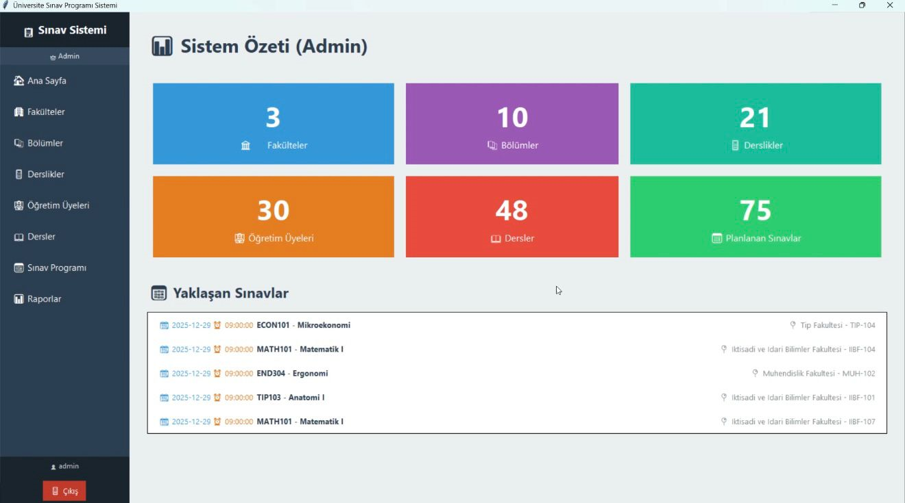
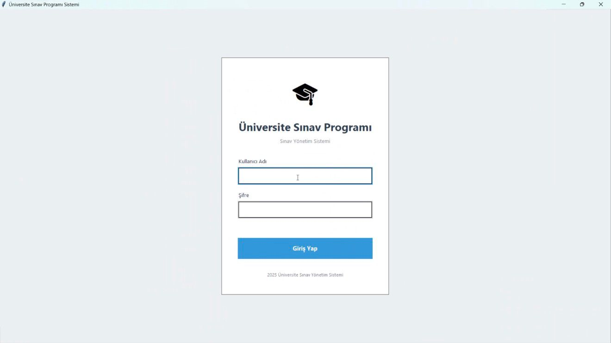
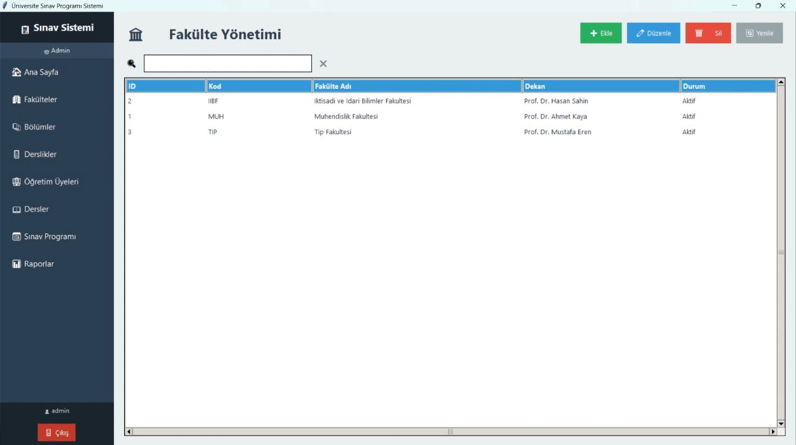
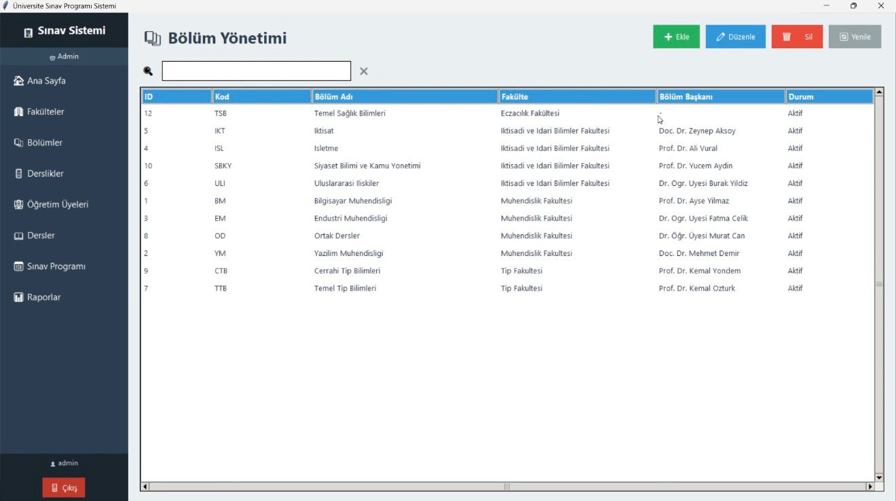
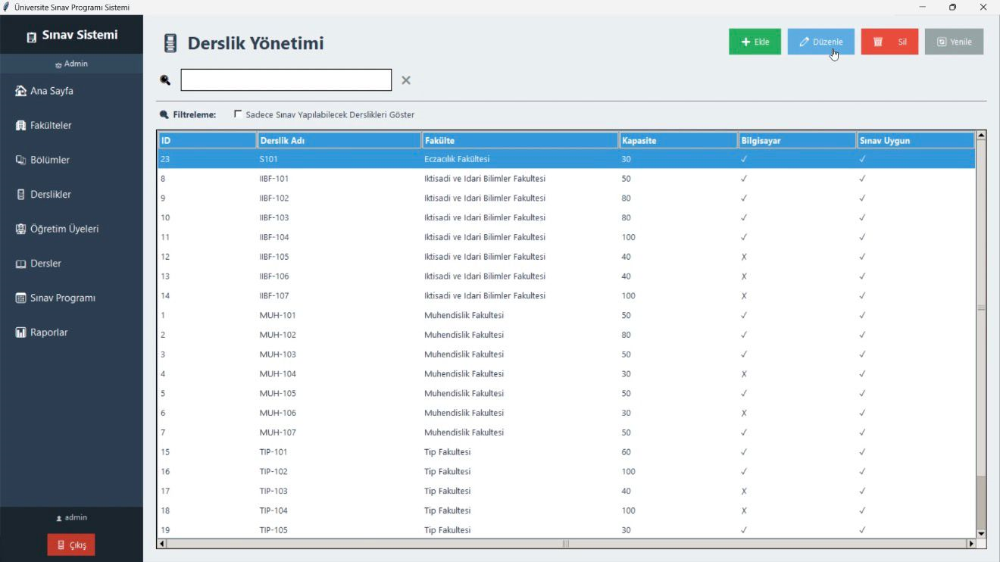
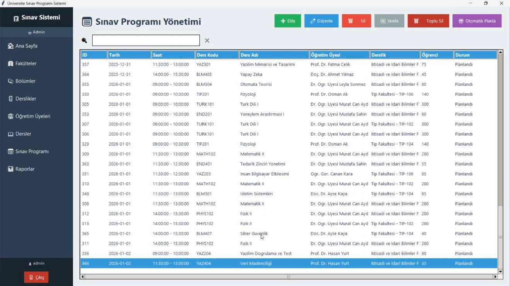
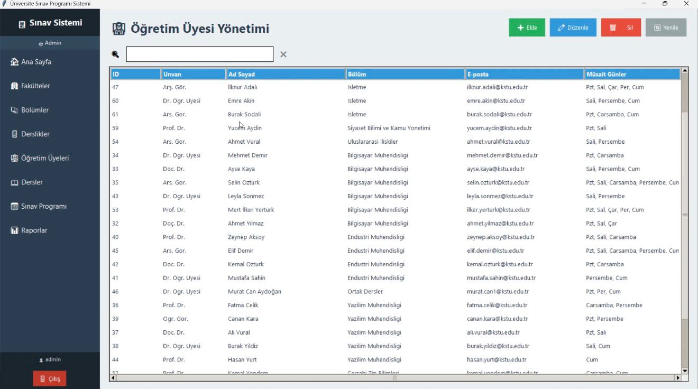
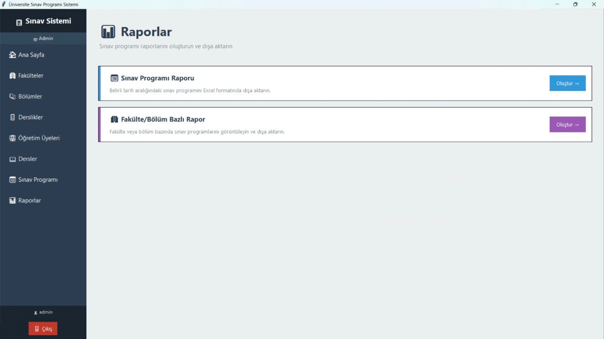

# 🎓 Exam Scheduling Management System


> A desktop-based exam scheduling and management system developed using Python.
> This project helps universities manage exams, classrooms, departments, and reports efficiently.

---

## 🌟 About The Project

This project was developed to simplify and automate university exam management processes.

The system provides:

* Automatic exam scheduling
* Smart conflict detection
* Faculty and classroom management
* Student and instructor management
* Excel report exporting
* Role-based authorization system
* Fast and modern desktop interface

---

## 🚀 Features

*  Role-Based Authentication System
*  Automatic Exam Scheduling Algorithm
*  Faculty & Classroom Management
*  Course & Department Management
*  Instructor Management
*  Student Management
*  Smart Conflict Detection
*  Excel Export Support
*  Secure Login System
*  Modern Tkinter GUI
*  Capacity & Availability Control
*  Fast Desktop Performance

---

## 🛠️ Technologies Used

| Category             | Technologies     |
| -------------------- | ---------------- |
| Programming Language | Python 3.10+     |
| GUI Framework        | Tkinter          |
| Database             | PostgreSQL       |
| Database Driver      | psycopg2         |
| Version Control      | Git & GitHub     |
| Architecture         | MVC Architecture |
| Reporting            | Excel Export     |
| SQL Tools            | SQL Scripts      |

---

## 📂 Project Structure

```text
📁 yazilimLab03
│
├── 📁 database
│   ├── 📄 setup_db.py
│   └── 📄 db_seeder.py
│
├── 📁 screenshots
│   ├── 🖼️ dashboard.png
│   ├── 🖼️ login.png
│   ├── 🖼️ bolum.png
│   ├── 🖼️ derslik.png
│   ├── 🖼️ fakulte.png
│   ├── 🖼️ ogretim.png
│   ├── 🖼️ rapor.png
│   └── 🖼️ sinav.png
│
├── 📁 docs
│
├── 📁 src
│   ├── 📁 config
│   ├── 📁 models
│   ├── 📁 repositories
│   ├── 📁 services
│   ├── 📁 controllers
│   ├── 📁 views
│   └── 📁 utils
│
├── 📄 README.md
└── 📄 requirements.txt
```

---

## 🔐 Demo Accounts

| Role               | Username     | Password |
| ------------------ | ------------ | -------- |
| Admin              | admin        | admin123 |
| Department Manager | fatma.celik  | 123456   |
| Instructor         | ahmet.yilmaz | 123456   |
| Student            | ogrenci.bm1  | 123456   |

---

## 🎯 User Roles

### 👑 Admin

* User management
* System configuration
* Global scheduling controls
* Database management

### 🏢 Department Manager

* Department exam management
* Course scheduling
* Classroom assignments

### 👨‍🏫 Instructor

* Manage own exam schedules
* View assigned classrooms
* Track exam details

### 👨‍🎓 Student

* View exam timetable
* Access exam information
* Check classroom details

---

## 📸 Screenshots

### 📊 Dashboard



---

### 🔐 Login Screen



---

### 🏫 Faculty Screen



---

### 📚 Department Screen



---

### 🏛️ Classroom Screen



---

### 📝 Exam Screen



---

### 🎓 Education Screen



---

### 📊 Report Screen



---

## 📊 System Capabilities

* Automatic conflict detection
* Classroom capacity control
* Instructor availability management
* Department-based scheduling
* Exam timetable export
* Multi-role authorization system
* Real-time scheduling validation

---

## 🔮 Future Improvements

* 🌐 Web-based version
* 🤖 AI-supported scheduling
* 📧 Email notification system
* 📄 PDF export support
* 🌙 Dark mode UI
* 🌍 Multi-language support
* ☁️ Cloud database integration

---

## 📄 License

This project is intended for educational and academic purposes only.

---

# ⭐ Support

If you like this project, consider giving it a ⭐ on GitHub.
